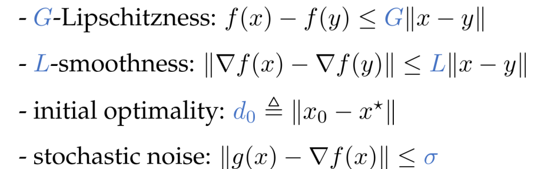
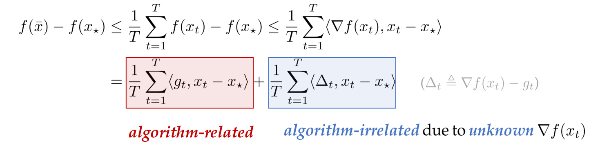

# 随机优化 Stochastic Optimization
## Problem Setup

Minimize $f(x)$

Subject to: $x \in \mathbb{R}^d$

本次讨论范围:
1. Unbounded domain $\mathbb{R}^d$
2. Convex $G$-Lipschitz function $f(\cdot)$

### Stochastic noise formulation:
$$
\mathbb{E}[\mathbf{g}(x)] = \nabla f(x), \\
\mathbb{E}\left[ \| \nabla f(x) - \mathbf{g}(x) \|^2 \mid x \right] \leq \sigma^2
$$

- Parameter-free: 在优化过程中，避免手动调参(学习率等)

## Benchmark: SGD
$SGD:x_{t+1} = x_t - \eta_t \mathbf{g}(x_t)$

凸-Lipschitz条件下，
$f(\bar{x})-f(x_*) \leq O(\frac{d_0(G+\sigma)}{\sqrt{T}})$

考虑algorithm-relatede部分，

Def:$d_t \triangleq \|x_t - x_*\|^2$,$G_t \triangleq \sum_{i\leq t} ||\mathbf{g}_i||^2$

