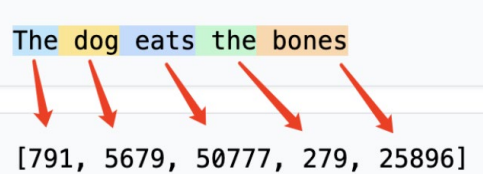
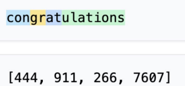

# 构建大模型流程一览
- $$Initial model \xrightarrow{Pretraining} Base model \xrightarrow{SFT} Chat model \xrightarrow{RLHF} Final model$$

# Tokenizer
## Word-base Tokenize

缺点：词表过大、缺失词间联系
## Sub-Word-base Tokenize
将一些词拆成2或多个token

# Word Embedding