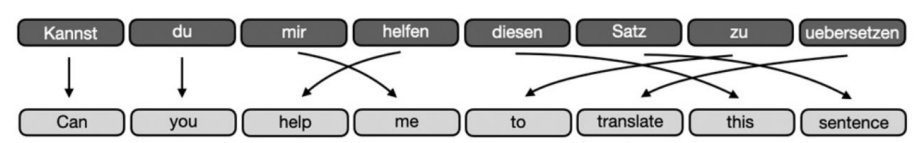
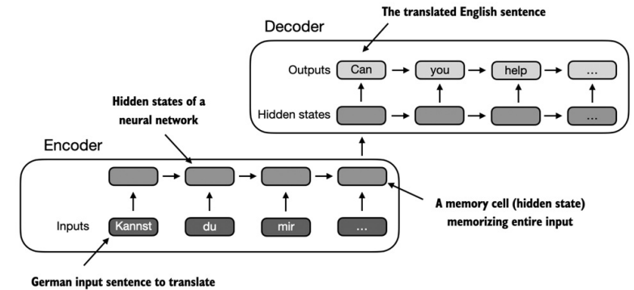
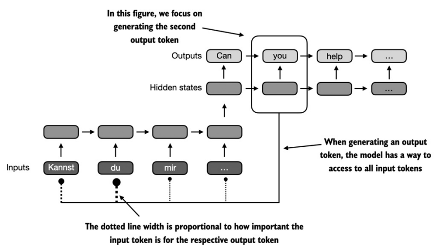
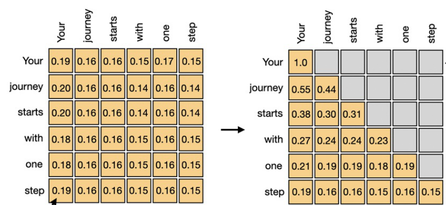
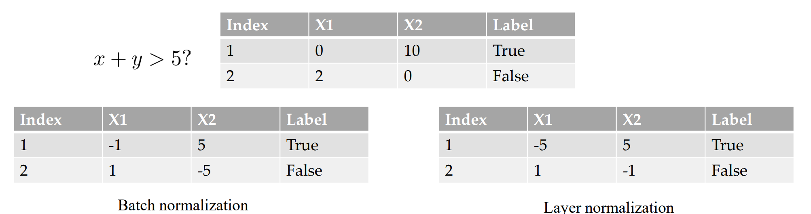
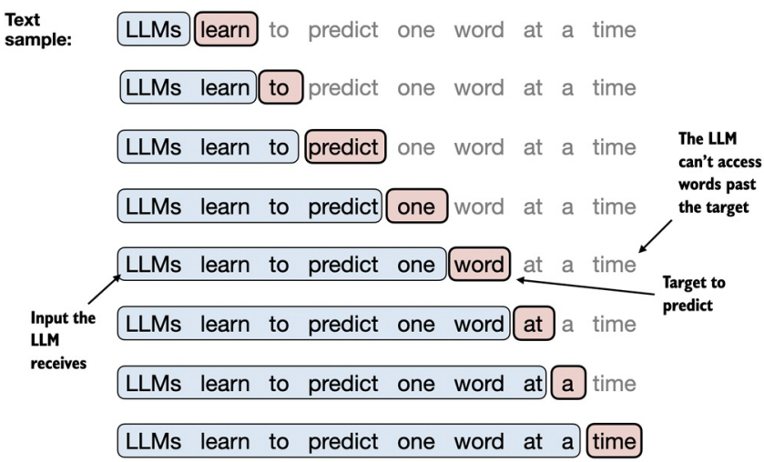
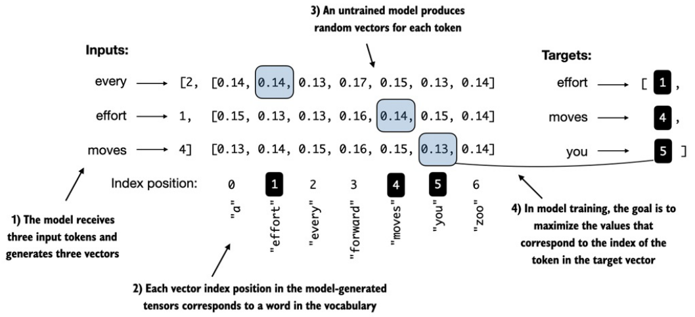
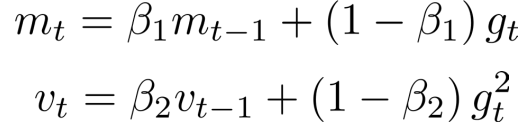

- 从头开始构建大语言模型
# 构建大模型流程一览
- $$Initial model \xrightarrow{Pretraining} Base model \xrightarrow{SFT} Chat model \xrightarrow{RLHF} Final model$$

# Tokenizer
## Word-base Tokenize

缺点：词表过大、缺失词间联系、存在OOV(Out of Vocabulary)问题
## Sub-Word-base Tokenize
将一些词拆成2或多个token

# Word Embedding
## 数据表示
将非数值型数据转换为神经网络可以处理的格式。即将词、图等离散量映射到连续向量空间中的点。[词嵌入]
- One-hot representation
  - 为每个词分配唯一向量
  - Ex: $'abandon' \rightarrow [1, 0, 0,……0],……,'zoo' \rightarrow [0, 0, 0,……1]$
- Distributed representation
  - 为每个词分配一个向量，向量维度远小于词表大小
  - 每个单词由连续的向量而非稀疏的0和1表示,且相似单词的向量也有相似性。
  
- 词嵌入矩阵(Embedding Matrix)
  - 词表大小为$V$，词向量维度为$D$，则词嵌入矩阵的大小为$V \times D$
  - 词嵌入矩阵的每一行对应一个词的词向量
  - 将独热编码的词向量乘以词嵌入矩阵，得到词的词向量
- Positional Embedding
  - Position-agnostic（与位置无关的嵌入）
    - 词向量不包含位置信息,只关心词本身的含义
  - Absolute positional embedding（绝对位置嵌入）
    - 每个位置有固定的嵌入向量，将其与词的嵌入向量相加
  - Relative positional embedding（相对位置嵌入）
    - 关注词汇之间的相对位置关系，而不是具体的绝对位置。这种方法通过计算单词之间的距离，而不是单词在句子中的确切位置来表示。
    - 正弦函数编码:$PE_{(pos, 2i)} = sin(pos/10000^{2i/D})$

# Attention
- 以翻译为例,生成时需要考虑句子的不同部分
- 
## Encoder-Decoder RNN图例与问题
- 
- Encoder将输入转为一个隐藏状态向量，Decoder根据该向量生成输出。
- 依赖于最后一个隐藏状态传递整个输入句子的所有信息，无法处理长距离依赖（难以保留足够的信息）
## Bahdanau attention
- 
- 注意力机制允许Decoder在生成每个单词时，能够动态访问编码器的所有隐藏状态，而不是只依赖于最后一个隐藏状态。
- 为输入句子的不同部分分配不同的注意力权重，使输出单词选择性地关注输入序列的不同部分。

## 简易self-attention模型
- 对输入向量间做点积，得到注意力矩阵$w_{ij}$
- $w_{ij}$归一化后得到注意力权重$\alpha_{ij}$
- $\alpha_{i1}…\alpha_{in}$构成注意力矩阵的第i行，即第i个词对其他词的注意力权重

## 计算Q、K、V
- Q(Query)、K(Key)、V(Value)是self-attention的三个输入矩阵
- Q、K、V的维度相同，通常为$d_k$
- Q、K、V的计算：
  - $Q = XW^Q$
  - $K = XW^K$
  - $V = XW^V$
- Attention矩阵的计算：
  - $Attention(Q, K, V) = softmax(\frac{QK^T}{\sqrt{d_k}})V$

## Casual self-attention(masked self-attention)
- 为了避免模型在生成时看到未来的信息，需要在self-attention中加入mask
- 只考虑之前和当前的词，不考虑之后的词
- 

## Multi-head attention(多头注意力)
- 多组权重矩阵$W_{Q_i}, W_{K_i}, W_{V_i}$，对应不同的“头”。
- 多组 Query（查询向量 $Q_i$）、Key（键向量 $K_i$）、Value（值向量 $V_i$）矩阵。

## Normalization
- 
- 对每个样本在各个维度的值归一化，而不是对每个维度上各个样本的值归一化

## 激活函数
- GELU: RELU + Dropout
- $GELU(x) = x * P(X ≤ x) = 0.5x(1 + tanh(\sqrt{2/π}(x + 0.044715 x^3)))$
- 具有连续的导数

# 预训练
## Pretrain: next token prediction
- 自回归训练
  - 
  - 只采用上文信息，无法利用下文信息
- Position Embedding
  - 
  - 将输入词转为词向量
  - 加入位置索引辅助位置编码
## 数据集
## Decoding
- softmax_with_temperature
  - scaled_logits = logits / temperature
  - 温度越高，输出越平滑，模型创造力越强
## 计算开销
- float32 = 4 Byte, float16 = 2 Byte
- $1B(billion) Params(F32) = 4 * 10^9 Byte = 4GB$
- 7B Params(F32) = 28GB
- 计上式为$w$
- 训练时,权重$w$,梯度$w$,
- 优化器[SGD:$w$,Adam:$2w$]
- - SGD: $w_{t+1} = w_t - \eta \nabla L(w_t)$ 
- - Adam: 
   
     
- 共计$3w$或$4w$
- 7B时至少需要84GB显存
# SFT (Supervised Fine-tuning)
# RLHF(RL with Human Feedback)

